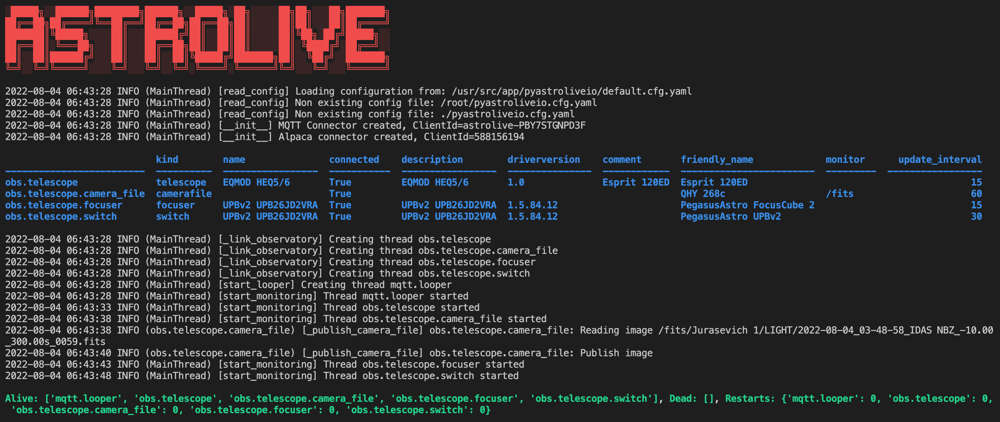
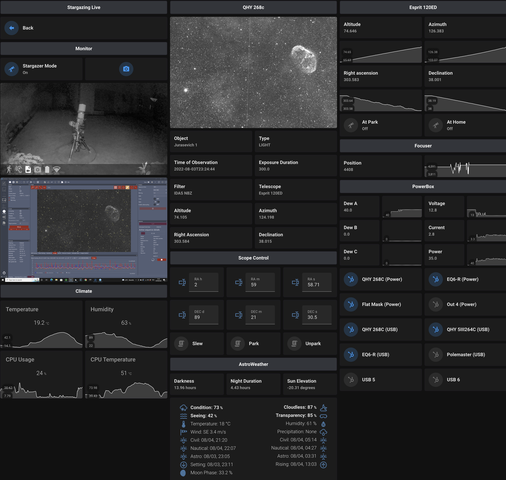
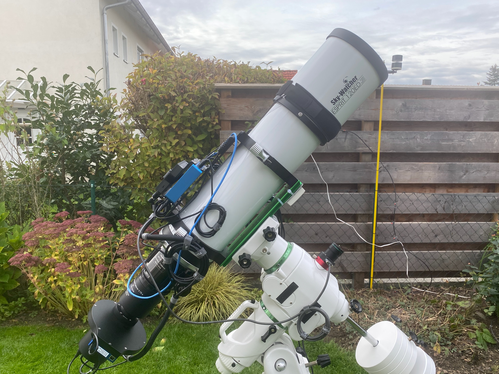
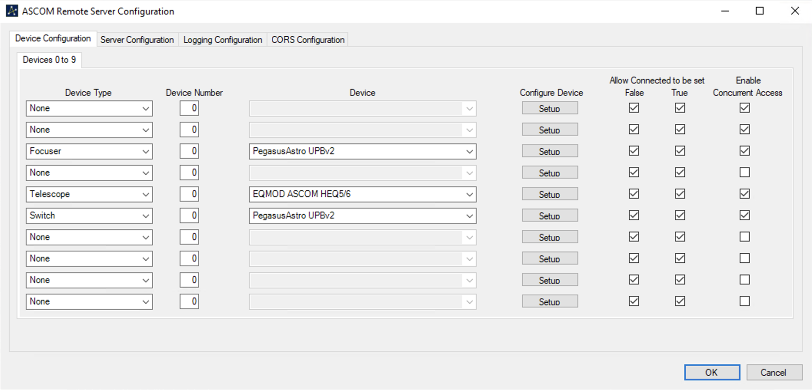
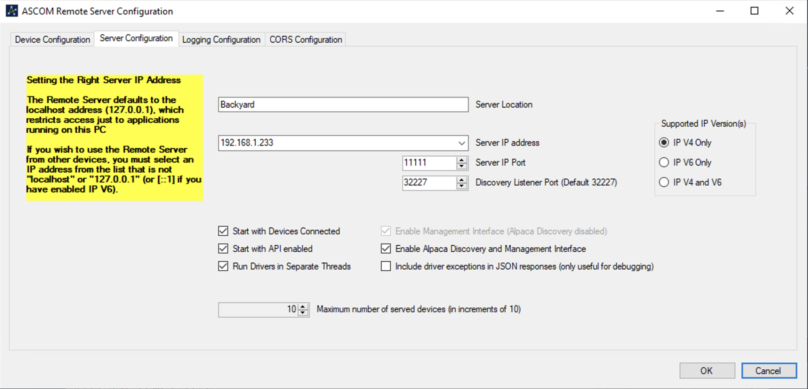
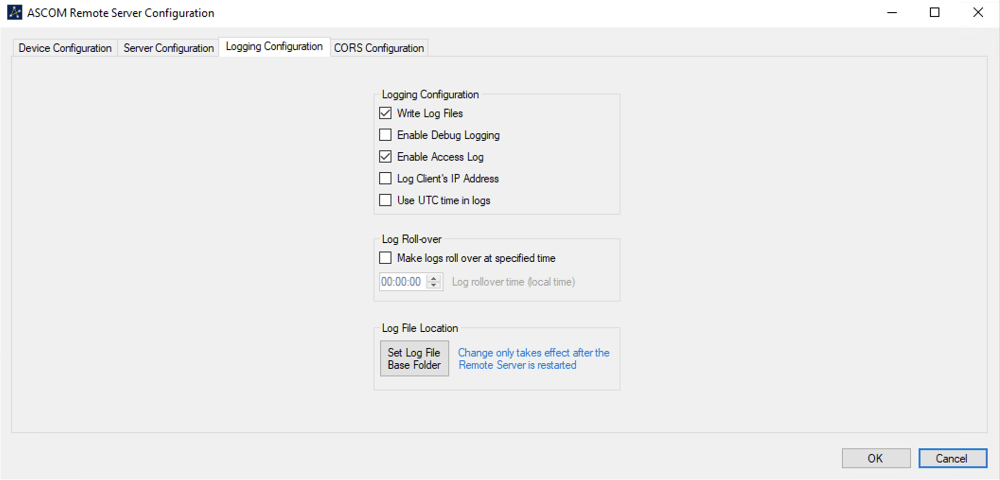

# AstroLive<!-- omit in toc -->

Connector for the ASCOM Alpaca REST API designed to work with Home Assistant via MQTT.



The integration with Home Assistant is implemented via MQTT for sensor and camera entities and supports autodiscovery of Home Assistant for the devices.



AstroLive uses the nice ALPACA client implementation of the [OCA Box](https://github.com/araucaria-project/ocaboxapi.git) classes which is used by the [Araucaria Project](https://araucaria.camk.edu.pl/).

## Table of Content<!-- omit in toc -->

- [How It Works](#how-it-works)
- [Requirements](#requirements)
- [My Personal Setup](#my-personal-setup)
- [Usage](#usage)
  - [Installation and Configuration of ASCOM Remote Server](#installation-and-configuration-of-ascom-remote-server)
  - [Get and Configure AstroLive](#get-and-configure-astrolive)
  - [Run](#run)
- [Integrate with Home Assistant](#integrate-with-home-assistant)
  - [Devices and Sensors](#devices-and-sensors)
  - [Sending Commands](#sending-commands)
    - [Input Texts](#input-texts)
    - [Scripts](#scripts)
    - [Lovelace UI](#lovelace-ui)

## How It Works

- AstroLive connects via the ASCOM Alpaca API to your observatory.
- For each configured and connected component a MQTT device configuration for sensors and if applicable camera is created below `homeassistant/sensor/astrolive/` and `homeassistant/camera/astrolive/` respectively.
- As of now the following components are supported:
  - Telescope
  - Camera
  - Camera via File
  - Focuser
  - Switch
  - FilterWheel
  - Dome
  - Rotator
  - SafetyMonitor
- These configurations allow MQTT auto discovery in Home Assistant.
- AstroLive then starts a seperate thread which queries the compenent status interval based according to the configuration and publishes the device state to MQTT.
- If the component is of the type Camera the last captured FITS image is autostretched, downsized and published as a .jpg. This is the same for Camera via file where AstroLive watches a directory for new FITS images.

Slewing the telescope using the equatorial coordinate system, moving the focuser and some more commands are possible directly from Home Assistant.

AstroLive is designed to run as a container to be deployed on a dedicated host or next to Home Assistant. It does ***not*** require any custom integration for Home Assistant since communication is solely via MQTT.

## Requirements

- A windows (mini) pc/notebook controlling your scope
- ASCOM Platform
- [ASCOMRemote](https://github.com/ASCOMInitiative/ASCOMRemote/releases).
- Container runtime engine (e.g. Docker).
- MQTT Broker (e.g. Mosquitto).
- A recent version of Home Assistant with MQTT autodiscovery enabled.

## My Personal Setup

To give you an idea how I did setup my observatory together with AstroLive and [AstroWeather](https://github.com/mawinkler/astroweather) here's my setup:

- Hardware
  - Telescope: Skywatcher Esprit 120ED
  - Mount: Skywatcher EQ6-R
  - Camera: QHY268c
  - Guide Camera: QHY5III462c
  - Off Axis Guider: OAG-M
  - Filter Wheel: QHY CFW3M-US
  - Switch: PegasusAstro Ultimate Powerbox v2
  - Focuser: PegasusAstro Focus Cube
  - Mini PC: MeLE Quieter2 8GB 256GB Windows 10 Pro
- Software:
  - NINA 2.0.0.9001
  - PHD2 2.6.11
  - ASCOM Platform 66
  - EQASCOM V200w
  - QHYCCD Win AllInOne 21.10.23.19
  - IOTLink 2.2.2
  - Polemaster 3.2.8
  - PegasusAstro Unity Platform 1.5.84.12
  - Dropbox



All off the software is running on the MeLE Quieter2 mini pc which I mounted on top of the scope. I configured NINA to store image files within a dedicated directory which is synced by Dropbox. This directory is then monitored by AstroLive to enable the image processing.

Since NINA does provide it's own drivers to interact with the QHY camera I did *not* connect the cameras to ASCOMRemote. During my tests with AstroLive I encountered problems while imaging if AstroLive uses the Camera API of ASCOMRemote. I need to investigate this further, but processing the resulting image stored on disk is working nicely for me and lowers the load on the mini pc anyways.

## Usage

> Ensure to have the ASCOM Platform deployed on your astro imaging server.

### Installation and Configuration of ASCOM Remote Server

Download and install the latest version from here: [ASCOMRemote](https://github.com/ASCOMInitiative/ASCOMRemote/releases)

<details><summary><b>Show instructions</b></summary>

Add the devices you want to use in conjunction of AstroLive. The following screenshot show a connected Focuser, Telescope and Switch.



You need to press [Setup] for each configured device to connect it to the ASCOM Remote Server Configuration.



Set a name for the servers location (e.g. Backyard) and specify the Server IP Address. This is the IP the Remote Server is running on. Choose a port (default is 11111) and leave the rest to the defaults.



Press [OK]

</details>

Links:

- [ASCOM Alpaca Device API](https://ascom-standards.org/api/)
- [Swagger](https://github.com/ASCOMInitiative/ASCOMRemote/blob/master/Swagger/ASCOMInitiative_ASCOMDeviceAPI_1.0.1-oas3_swagger.yaml)

### Get and Configure AstroLive

Clone AstroLive

```sh
git clone https://github.com/mawinkler/astrolive
```

Now, create a `default.cfg.yaml` based on the supplied `default.cfg.yaml.sample` and modify it to your needs. The yaml should be pretty self explanatory :-)

```sh
cp astrolive/default.cfg.yaml.sample astrolive/default.cfg.yaml
```

> ***Note:*** If you are using drivers provided with the sequencer software, using ASCOM remote in parallel will mess up the imaging session when accessing the camera API. Tested with QHY and N.I.N.A./PHD2. For that reason, I'm always using the `camera_file` component witch checks for the latest FITS-file published within a given directory tree.

<details><summary><b>Show YAML</b></summary>

```yaml
default:
  include: backyard

backyard:
  observatory:
    # Name of the observatory
    comment: Backyard Scope
    # Longitude
    lon: <LONGITUDE>
    # Lattitude
    lat: <LATTITUDE>
    # Elevation
    elev: <ELEVATION>
    # Communication protocol
    protocol: alpaca
    # Address of the ASCOM Remote server
    address: http://<IP OF ASCOMRemote>:11111/api/v1

    components:
      telescope:
        # Kind of the device
        kind: telescope
        comment: <NAME OF YOUR SCOPE>
        # Device number as configured in ASCOM Remote
        device_number: 0
        # Name prefix of the created sensor in MQTT
        friendly_name: <NAME OF YOUR SCOPE>
        # Update interval in seconds
        update_interval: 15
        # List of components belonging to the telescope
        components:
          # Note to ASCOM:
          # If you are using drivers provided with the sequencer software,
          # using ASCOM remote in parallel will mess up the imaging session.
          # Tested with QHY and N.I.N.A./PHD2.
          
          # Valid device kinds are
          #   telescope: Telescope
          #   dome: Dome
          #   camera: Camera
          #   filterwheel: Filter Wheel
          #   focuser: Focuser
          #   rotator: Rotator
          #   switch: Switch
          #   safetymonitor: SafetyMonitor
          #   camera_file: Camera File, reads and processes the latest image within
          #     from a configured location.

          # camera:
          #   # Kind of the device
          #   kind: camera
          #   # Device number as configured in ASCOM Remote
          #   device_number: 0
          #   # Name prefix of the created sensor in MQTT
          #   friendly_name: <NAME OF YOUR IMAGING CAMERA>
          #   # Get image via ASCOM remote. If false, process sensors only
          #   image: true
          #   # Update interval in seconds
          #   update_interval: 60

          # guiding_camera:
          #   kind: camera
          #   device_number: 1
          #   friendly_name: <NAME OF YOUR GUIDING CAMERA>
          #   image: true
          #   update_interval: 60

          camera_file:
            kind: file
            friendly_name: <NAME OF YOUR IMAGING CAMERA>
            # Monitoring directory for new image files
            # Only FITS files are supported
            monitor: '/fits'
            update_interval: 60

          focuser:
            kind: focuser
            friendly_name: <NAME OF YOUR FOCUSER>
            update_interval: 15

          switch:
            kind: switch
            friendly_name: <NAME OF YOUR SWITCH>
            update_interval: 30

          filterwheel:
            kind: filterwheel
            friendly_name: <NAME OF YOUR FILTERWHEEL>
            update_interval: 15

          dome:
            kind: dome
            friendly_name: <NAME OF YOUR DOME>
            update_interval: 30
          
          safetymonitor:
            kind: safetymonitor
            friendly_name: <NAME OF YOUR SAFETYMONITOR>
            update_interval: 30

          rotator:
            kind: rotator
            friendly_name: <NAME OF YOUR ROTATOR>
            update_interval: 30

    # MQTT configuration
    mqtt:
      # Address of the MQTT broker
      broker: <IP OF YOUR BROKER>
      # Listen port of the MQTT broker
      # defaut 1883 or 8883 for tls
      port: 1883
      # Client name for astrolive
      client: astrolive
      # Username
      username: ''
      # Password
      password: ''
      # TLS insecure
      tls:
        enabled: False
        insecure: True
        # The certification authority certificate which signed the MQTT server certicate
        ca: /certs/ca.crt
```

</details>

### Run

AstroLive checks recursively within the configured directory for new FITS files if you configured `camera_file`. By default it checks within the directory `/fits`.

If you want to use TLS for the connection to the MQTT broker you need to provide the certificate of the certification authority which signed the MQTT server certificate (defaults to `/certs/ca.crt`).

**Run with Python**

Ensure to have the dependencies installed

```sh
pip3 install -r requirements.txt
```

Start AstroLive

```sh
python3 run.py
```

**Build & Run as a container**

This is the way :-).

```txt
| [T]  
| | |√  <••>  
| ( )   (  )  
```

Build

```sh
docker build --tag astrolive .
```

Run

```sh
# As a container
docker run \
  --volume /fits:/fits:ro \
  --name astrolive \
  --rm \
  astrolive

# As a detached container
docker run \
  --volume /fits:/fits:ro \
  --name astrolive \
  --rm -d \
  astrolive
```

Docker-compose example:

```yaml
version: "3.2"
services:
  astrolive:
    image: astrolive:latest
    container_name: astrolive
    depends_on:
      - mqtt
    environment:
      - TZ=Europe/Berlin
    volumes:
      - /fits:/fits:ro
    restart: always
```

<details><summary><b>If using TLS</b></summary>

```sh
# As a container
docker run \
  --volume /fits:/fits:ro \
  --volume /certs:/certs:ro \
  --name astrolive \
  --rm \
  astrolive

# As a detached container
docker run \
  --volume /fits:/fits:ro \
  --volume /certs:/certs:ro \
  --name astrolive \
  --rm -d \
  astrolive
```

Docker-compose example:

```yaml
version: "3.2"
services:
  astrolive:
    image: astrolive:latest
    container_name: astrolive
    depends_on:
      - mqtt
    environment:
      - TZ=Europe/Berlin
    volumes:
      - /fits:/fits:ro
      - /certs:/certs:ro
    restart: always
```

</details>

## Integrate with Home Assistant

Effectively, there is no configuration required if you just want to monitor your observatory. Simply creating your Lovelace UI using the generated sensors and camera(s) would do the trick.

### Devices and Sensors

The following devices with the sensors attached are created in Home Assistant based on the example `default.cfg.yaml` from above:

Telescope | Camera | Switch | Focuser | FilterWheel | Dome | Rotator | SafetyMonitor
--------- | ------ | ------ | ------- | ----------- | ---- | ------- | -------------
At home | Image Type | Max switch | Position | Position | Altitude | Mechanical position | Is safe
At park | Exposure Duration | Switch 0 | Is moving | Names | At home | Position
Altitude | Time of observation | Switch 1 | | Current | At park
Azimuth | X axis binning | Switch ... | | | Azimuth
Declination | Y axis binning | | | | Shutter status
Declination rate | Gain
Guiderate declination | Offset
Right ascension | Pixel X axis size
Right ascension rate | Pixel Y axis size
Guiderate right ascension | Imaging instrument
Side of pier | CCD temperature
Site elevation | Filter
Site Latitude | Sensor readout mode
Site Longitude | Sensor Bayer pattern
Slewing | Telescope
|| Focal length
|| RA of telescope
|| Declination of telescope
|| Altitude of telescope
|| Azimuth of telescope
|| Object of interest
|| RA of imaged object
|| Declination of imaged object
|| Rotation of imaged object
|| Software

My personal Lovelace configuration from the screenshot above using `mushroom-entity-card`, `button-card`, `grid` and `picture-entity`:

- [QHY 268c](config/qhy268c.yaml)
- [Esprit 120ED](config/esprit120ed.yaml)
- [Focuser](config/focuser.yaml)
- [Powerbox](config/powerbox.yaml)
- [FilterWheel](config/filterwheel.yaml)

### Sending Commands

Sending commands to the observatory is implemented by the use of input texts and the mqtt publisher service of Home Assistant. To not accidentaly park/slew the scope or power of the camera during an imaging session I'm intentionally using dedicated buttons to send a command.

#### Input Texts

The initial values of RA and DEC are pointing to Polaris

<details><summary><b>Show YAML</b></summary>

```yaml
astrolive_target_ra_h:
  name: Target RA h
  min: 0
  max: 24
  initial: 02

astrolive_target_ra_m:
  name: Target RA m
  min: 0
  max: 60
  initial: 59

astrolive_target_ra_s:
  name: Target RA s
  min: 0
  max: 60
  initial: 58.71

astrolive_target_dec_d:
  name: Target DEC d
  min: -90
  max: 90
  initial: 89

astrolive_target_dec_m:
  name: Target DEC m
  min: 0
  max: 60
  initial: 21

astrolive_target_dec_s:
  name: Target DEC s
  min: 0
  max: 60
  initial: 30.5

astrolive_focuser_position:
  name: Focuser Position
  min: 0
  max: 35000
  initial: 10000
```

</details>

#### Scripts

Sending a single command like `park` and `unpark`.

<details><summary><b>Show YAML</b></summary>

```yaml
alias: AstroLive - Send Command
sequence:
  - service: mqtt.publish
    data:
      topic: astrolive/command
      payload_template: >
        {{ '{{ "component": "{}", "command": "{}" }}'.format( component,
        command) }}
mode: single
```

</details>

Slewing the telescope.

<details><summary><b>Show YAML</b></summary>

```yaml
alias: AstroLive - Send Command Slew
sequence:
  - service: mqtt.publish
    data:
      topic: astrolive/command
      payload_template: >
        {{ '{{ "component": "{}", "command": "slew", "ra": "{}", "dec": "{}"
        }}'.format( component | trim, ra | trim, dec | trim ) }}
mode: single
```

</details>

Moving the focuser.

<details><summary><b>Show YAML</b></summary>

```yaml
alias: AstroLive - Send Command Focuser Move
sequence:
  - service: mqtt.publish
    data:
      topic: astrolive/command
      payload_template: >
        {{ '{{ "component": "{}", "command": "move", "position": "{}"
        }}'.format( component | trim, position | trim ) }}
mode: single
```

</details>

Turning on or off a port on the switch.

<details><summary><b>Show YAML</b></summary>

```yaml
alias: AstroLive - Send Command Switch On/Off
sequence:
  - service: mqtt.publish
    data:
      topic: astrolive/command
      payload_template: >
        {{ '{{ "component": "{}", "command": "{}", "id": "{}" }}'.format(
        component | trim, command | trim, id | trim ) }}
mode: single
```

</details>

Changing a filter.

<details><summary><b>Show YAML</b></summary>

```yaml
alias: AstroLive - Send Command FilterWheel Set Position
sequence:
  - service: mqtt.publish
    data:
      topic: astrolive/command
      payload_template: >
        {{ '{{ "component": "{}", "command": "setposition", "position": "{}"
        }}'.format( component | trim, position | trim ) }}
mode: single
```

</details>

#### Lovelace UI

Using `button-card`, `entities` and the `mushroom-entity-card` cards.

- [Scope Control](config/scope-control.yaml)
